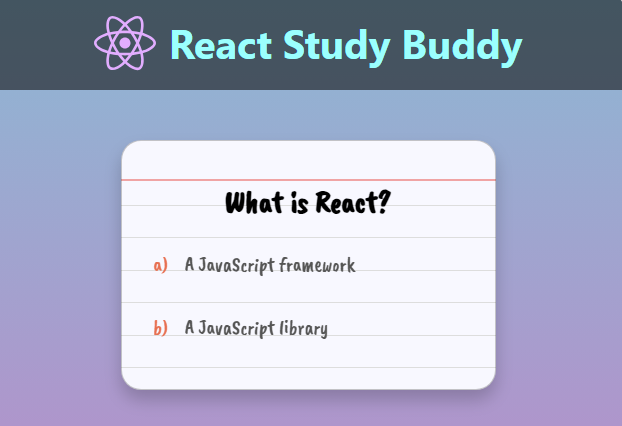
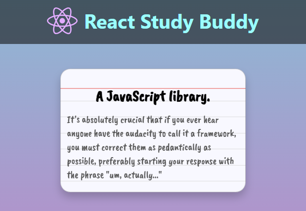

# React Study Buddy

## Background
This is one of 40 challenges in Scrimba's <a href="https://v2.scrimba.com/react-challenges-c02n">React Challenges</a> 

## Challenge

```
The flashcard needs to flip back and forth. Your task is to set this up as follows: 
    
        1. When the user clicks on the flashcard, the CSS class "flipped" should 
           be added to the div with the className of "flash-card" on line 39. 
           
        2. If the user clicks on the flashcard again, the class "flipped" should be removed 
           from the div. 
           
        3. The same pattern should be repeated for any subsequent clicks, so that the user can 
           continue flipping the card back and forth as many times as they want. 
```

<br/>

<em>Flashcard not flipped.</em>
<br/>
<br/>
<br/>

<em>Flashcard flipped.</em>
<br/>
<br/>

## Technologies
- HTML
- CSS
- React

## Live link
The solution is deployed here:
[https://tenzies-sv-ts.netlify.app](https://tenzies-sv-ts.netlify.app)
